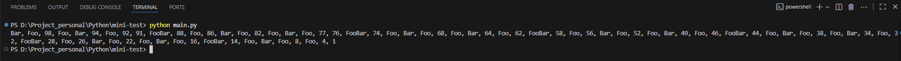

```markdown
# 🐍 FooBar Number Printer

Program sederhana berbasis Python untuk menampilkan deret angka **1 sampai 100** dengan aturan khusus:

- Deret ditampilkan **secara terbalik** (100 → 1).
- Bilangan **prima tidak ditampilkan**.
- Bilangan kelipatan **3** diganti dengan `Foo`.
- Bilangan kelipatan **5** diganti dengan `Bar`.
- Bilangan kelipatan **3 dan 5** diganti dengan `FooBar`.
- Hasil ditampilkan **horizontal** (dalam satu baris).

---

## 🚀 Contoh Output

Berikut contoh hasil ketika program dijalankan:



---

## 📂 Struktur Project

```

mini-test/
│── main.py             # Script utama
│── README.md           # Dokumentasi
│── array_example.png   # Screenshot hasil output

````

---

## 🛠️ Cara Menjalankan

1. Clone repository ini atau salin file `main.
2. Pastikan Python sudah terinstal (minimal **Python 3.7**).
3. Jalankan perintah berikut di terminal:

```bash
python main.py
````

## 📜 Lisensi

Proyek ini hanya untuk teste,dan modifikasi sesuai kebutuhan.

```
```
